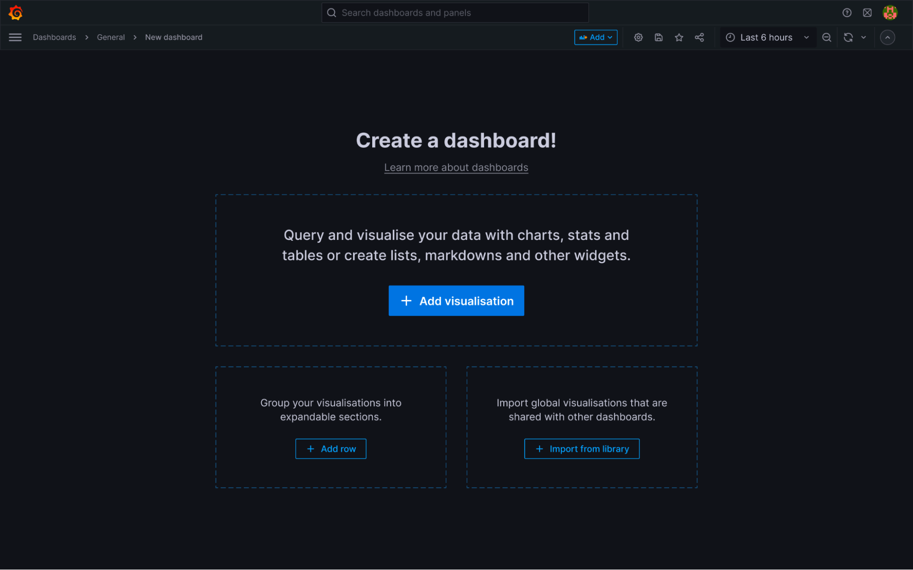
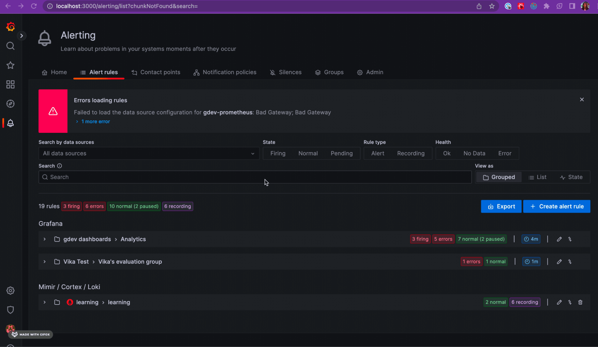
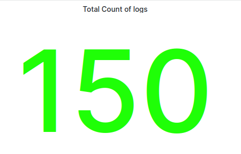
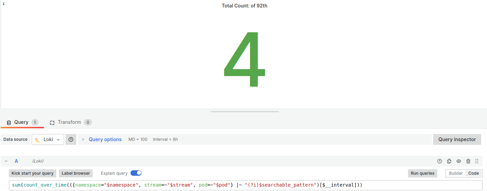
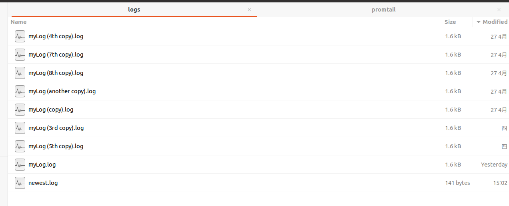

# 三、功能介绍

## 1.Grafana + Loki功能介绍
### 1.1 Loki索引元元素
    Loki 采用了一种独特的方法，仅索引元数据而不是日志行的全文。

### 1.2 Loki接收日志源
使用各种客户端从任何来源以任何格式发送日志。

### 1.3 Loki存储日志
拥有对象存储的100%持久性可以获得PB级、高吞吐量以及经济高效且持久的存储。

### 1.4 Loki LogQL查询
使用Loki强大的查询语言LogQL来探索您的日志。直接在Grafana中运行LogQL查询以将您的日志与其他数据源一起可视化，或者使用LogCL。

### 1.5 Grafana仪表盘
开源社区贡献各种仪表盘，通过优化的布局轻松与您的面板交互，提供更好的可访问性和更直观的体验。在面板标题中发现改进，例如简洁的面板描述、简化的错误消息和可访问的关键操作。

### 1.6 Grafana 警报与注释
警报挂钩允许您使用一些代码创建不同的通知程序。直观地为最重要的指标定义警报规则。
体验 Grafana 警报系统的重大改进，例如从多个数据源搜索警报规则，直接从仪表板或面板访问警报规则，以及从警报规则导航到相关的仪表板或面板。警报规则设置和通知策略也有更新，有助于减少警报噪音。

使用来自不同数据源的丰富事件注释图表。将鼠标悬停在事件上以查看完整的事件元数据和标签。

### 1.7 实时更新与按时间查询
实时跟踪您的日志以在日志进入系统时查看日志、每隔特定时间更新日志、查看特定日期的日志。

## 2. Grafana仪表盘Dashboard举例
### 2.1 统计日志行数
protmail采集日志的目录（6个文件*25行=**150**）：

统计与展示日志行数：

### 2.2 关键字搜索LogQL
通过LogQL语法写查询语句，搜索关键字”92th"

### 2.3 同步更新
protmail采集日志的目录,复制添加两个文件（8个文件*25行=**200**）：

仪表盘同步更新

### 2.4 按时间显示
通过**时间选择器**按相对时间或者绝对时间显示；

选择显示最近半个小时只有newest.log是新添加的日志：

newest.log的日志内容：

仪表盘刷新：

### 2.5 多job设置
以上protmail添加了一个采集job，yaml配置如之前【环境】章节描述，现在修改yaml配置。

## 3. 参考链接
[loki introduction](https://grafana.com/oss/loki/)

[Grafana Dashboards](https://grafana.com/docs/grafana/latest/dashboards/use-dashboards/)

[Grafana introduction](https://grafana.com/docs/grafana/latest/introduction/)
