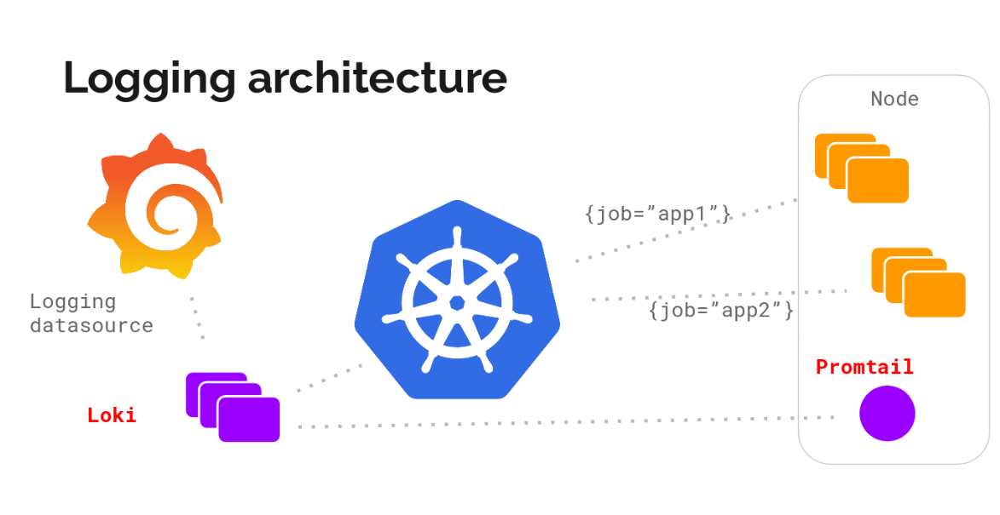
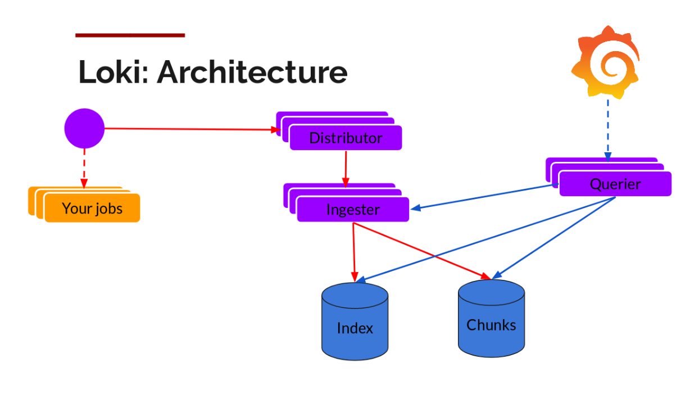
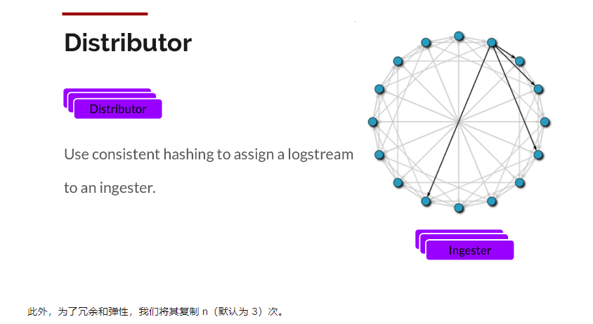
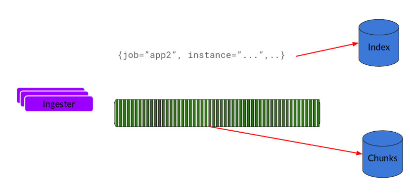
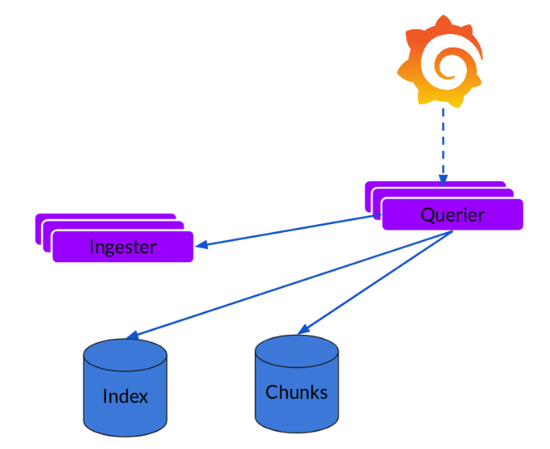

# 一、介绍

## 1. loki简介
**Loki**是由Grafana Labs团队开源的的多租户日志聚合系统。 开发语言: Google Go。使用标签来作为索引，而不是对全文进行检索。系统架构由以下3个部分组成 ：

 1. **Loki** 是主服务器，负责存储日志和处理查询 。
 2. **promtail** 是代理，负责收集日志并将其发送给 loki 。
 3. **Grafana** 用于 UI 展示。

## 2. loki架构

**写入路径**（红色）和**读取路径**（蓝色）分离；
### Distributor
一旦 promtail 收集日志并将其发送到 Loki，分发器就是第一个接收日志的组件。现在我们每秒可以接收数百万次写入，我们不想在它们进入时将它们写入数据库。那会杀死那里的任何数据库。我们需要在数据传入时对其进行批处理和压缩。

我们通过构建压缩的数据块来实现这一点，方法是在日志进入时对其进行 gzip 压缩。 ingester 组件是一个有状态的组件，负责构建然后刷新数据块。我们有多个摄取器，属于每个流的日志应该始终在同一个摄取器中结束，以便所有相关条目在同一个块中结束。我们通过构建一个摄取器环并使用一致性哈希来做到这一点。当一个条目进来时，分发器对日志的标签进行哈希处理，然后根据哈希值查找将条目发送到哪个 Ingester。

### Ingester
这基本上是 gzip 日志并附加它们。一旦块“填满”，我们将其刷新到数据库。我们为块 (ObjectStorage) 和索引使用单独的数据库，因为它们存储的数据类型不同。

### Querier
让查询器完成大部分繁重的工作。给定一个时间范围和标签选择器，它会查看索引以确定哪些块匹配，然后通过它们进行 greps 以提供结果。它还与Ingester对话以获取尚未刷新的最新数据。

## 3. 参考链接
[Loki: open source logging for cloud natives](https://grafana.com/blog/2018/12/12/loki-prometheus-inspired-open-source-logging-for-cloud-natives/)